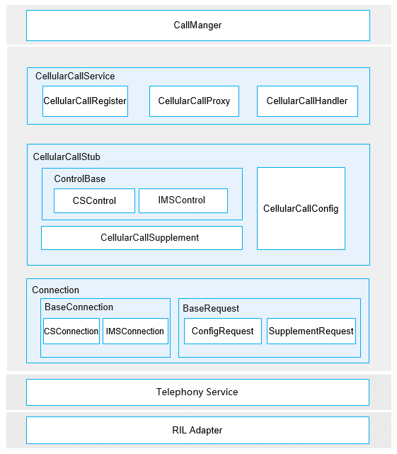

# Cellular Call<a name="EN-US_TOPIC_0000001105379632"></a>

-   [Introduction](#section117mcpsimp)
-   [Directory Structure](#section127mcpsimp)
-   [Constraints](#section131mcpsimp)
-   [Repositories Involved](#section204mcpsimp)

## Introduction<a name="section117mcpsimp"></a>

The cellular call module provides basic call services based on carrier networks, including 2G/3G circuit switch \(CS\) calls and 4G/5G IP multimedia subsystem \(IMS\) calls \(VoLTE/VoWIFI/VoNR voice, video, and conference calls\). It also supports domain selection and handover between CS and IMS calls, as well as emergency calls. The module is compatible with mainstream modem chip platforms.

The following figure shows the architecture of the cellular call module.

**Figure  1**  Architecture of the cellular call module<a name="fig970511919486"></a>




The cellular call module consists of three layers:

1.  Cellular call management layer \(CellularCallService\): consists of CellularCallRegister, CellularCallProxy, and CellularCallHandler. CellularCallRegister provides the function of registering an observer for call information changes; CellularCallProxy functions as a proxy for implementing external APIs of CellularCallService; CellularCallHandler processes callback events reported by the RIL Adapter.
2.  Cellular call service layer \(CellularCallStub\): consists of CSControl, IMSControl, CellularCallConfig, and CellularCallSupplement. CSControl implements CS call control; IMSControl implements IMS call control; CellularCallConfig implements call information configuration and query; CellularCallSupplement implements supplementary services.
3.  Cellular call connection layer \(Connection\): consists of BaseConnection, ConfigRequest, and SupplementRequest. BaseConnection implements the call session connection function; ConfigRequest implements configuration requests; SupplementRequest implements supplementary service requests.

## Directory Structure<a name="section127mcpsimp"></a>

```
/base/telephony/cellular_call #Cellular call module
├─ BUILD.gn                       # Build script (gn)
├─ README.md                      # Readme
├─ services
│  ├─ common                      # Tools
│  ├─ connection                  # Connection layer
│  ├─ control                     # Control service layer
│  └─ manager                     # Management layer
├─ sa_profile                     # SA profile
├─ ohos.build                     # Build code
└─ test                           # Test code
```

## Constraints<a name="section131mcpsimp"></a>

-   Programming language: JavaScript
-   In terms of software, this module needs to work with the telephony core service \(core\_service\) and Call Manager \(call\_manager\).
-   In terms of hardware, the accommodating device must be equipped with a speaker or earphone, a headset, and a modem and a SIM card capable of independent cellular communication.

>**NOTE:**
>Interfaces for cellular calls are not exposed externally and are directly called by the Call Manager.

## Repositories Involved<a name="section204mcpsimp"></a>

Telephony

telephony_cellular_call

telephony_core_service

telephony_call_manager